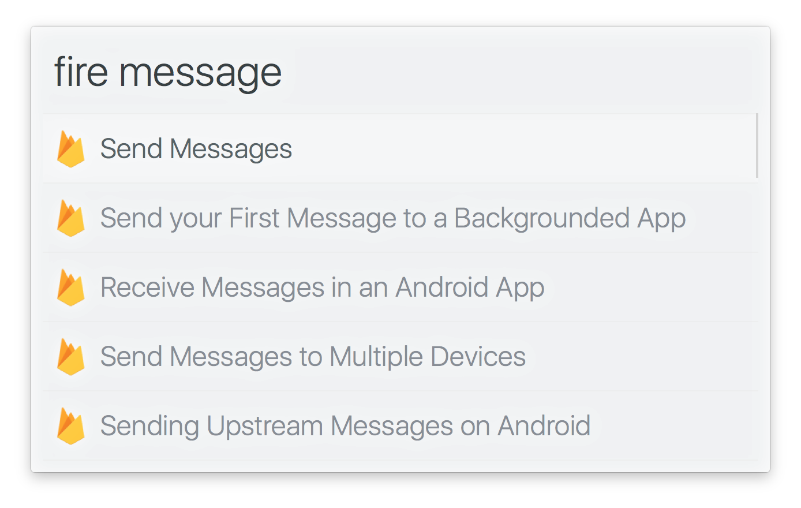

# alfred-firebase [](https://travis-ci.org/SamVerschueren/alfred-firebase)

> Search through the Firebase documentation




## Install

```
$ npm install -g alfred-firebase
```

*Requires [Node.js](https://nodejs.org) 4+ and the Alfred [Powerpack](https://www.alfredapp.com/powerpack/).*


## Usage

In Alfred, type `fire`, <kbd>Enter</kbd>, and your query.

Select an item and press <kbd>Enter</kbd> to go to its [Firebase](https://firebase.google.com/docs/) documentation.<br>
Press <kbd>Shift</kbd> to view the documentation in Quick Look.


## Related

- [alfred-ng2](https://github.com/SamVerschueren/alfred-ng2) - Search for Angular 2 API references on angular.io
- [alfred-ionic](https://github.com/SamVerschueren/alfred-ionic) - Search through the Ionic documentation
- [alfred-npms](https://github.com/sindresorhus/alfred-npms) - Search for npm packages with npms.io
- [alfy](https://github.com/sindresorhus/alfy) - Create Alfred workflows with ease


## License

MIT © [Sam Verschueren](https://github.com/SamVerschueren)
